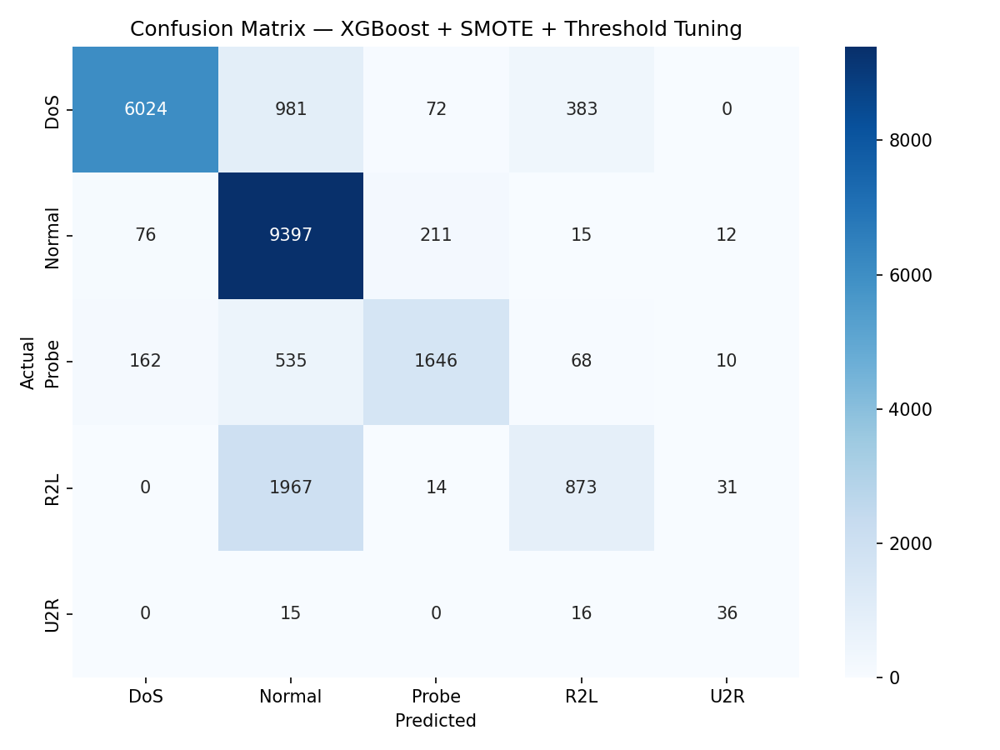

# Network Intrusion Detection — Assignment Report

**Authors:** Huseyn Mirjavadov, Ulvi Balashov

---

## 1. Introduction

The goal of this assignment was to build a machine learning model that classifies network connections into five categories: Normal, DoS, Probe, R2L, and U2R. The main challenge is that the dataset is heavily imbalanced — U2R has only 52 training examples while Normal has over 67,000. The baseline Random Forest model achieves a macro F1-score of around 0.47, mostly because it almost completely fails to detect R2L and U2R attacks. Our goal was to beat that.

---

## 2. What We Tried

We experimented with several approaches, each building on the previous one. Here is the full progression:

| Attempt | Approach | Macro F1 |
|---------|----------|----------|
| Baseline | Random Forest, default settings | 0.47 |
| Run 1 | XGBoost + SMOTE (R2L=5k, U2R=500) | 0.5917 |
| Run 2 | XGBoost + SMOTE (R2L=10k, U2R=2k) | 0.6035 |
| Run 3 | XGBoost + SMOTE (R2L=20k, U2R=3k) + sample weights | 0.6240 |
| Run 4 | Two-stage XGBoost (binary + multiclass) | 0.5729 |
| Run 5 | Compared Random Forest, LightGBM, XGBoost | 0.6240 |
| Run 6 | XGBoost + threshold tuning (R2L=0.3, U2R=0.2) | 0.6515 |
| Run 7 | XGBoost + threshold tuning (R2L=0.15, U2R=0.1) | 0.6556 |
| **Run 8** | **XGBoost + threshold tuning (R2L=0.005, U2R=0.003)** | **0.6674** |

### Algorithm Selection

We started with XGBoost because, unlike Random Forest which trains each tree independently, XGBoost trains trees sequentially — each new tree corrects the mistakes of the previous ones. This makes it better at learning from rare classes like U2R that a normal model would just ignore.

We also tested Random Forest and LightGBM for comparison. The results were:

- Random Forest: 0.5245
- LightGBM: 0.6003
- XGBoost: 0.6240

XGBoost came out on top, so we used it as our base model going forward.

### Handling Class Imbalance with SMOTE

The biggest problem with this dataset is the imbalance. U2R has 52 training records — there simply is not enough data for any model to learn what U2R attacks look like. We used SMOTE (Synthetic Minority Over-sampling Technique) to generate synthetic examples by interpolating between existing minority class records. We oversampled R2L to 20,000 examples and U2R to 3,000.

We also assigned sample weights during training so that misclassifying R2L and U2R was penalized more heavily — R2L errors cost 5x more and U2R errors cost 10x more than Normal errors. This forced the model to take minority classes more seriously.

### Two-Stage Classification (Did Not Help)

We also tried splitting the problem into two stages: first a binary classifier to decide Normal vs Attack, then a separate classifier to identify which type of attack. The idea was that R2L looks so similar to Normal that a dedicated binary model might catch more of them. In practice this scored 0.5729 — worse than the single model — because the binary classifier still struggled with R2L, and any R2L misclassified as Normal never even reached the second stage.

### Threshold Tuning

The most effective improvement came from adjusting the decision thresholds. By default, a model predicts whichever class has the highest probability. We modified this so that R2L and U2R had much lower thresholds — meaning the model only needed a small probability of R2L or U2R to predict those classes. This made the model more aggressive about catching rare attacks, at the cost of some precision. This pushed our score from 0.6240 to 0.6674.

---

## 3. Results

### Final Classification Report

```
              precision    recall  f1-score   support

         DoS       0.96      0.81      0.88      7460
      Normal       0.73      0.97      0.83      9711
       Probe       0.85      0.68      0.75      2421
         R2L       0.64      0.30      0.41      2885
         U2R       0.40      0.54      0.46        67

    accuracy                           0.80     22544
   macro avg       0.72      0.66      0.67     22544
weighted avg       0.81      0.80      0.78     22544
```

**Final Test Macro F1-score: 0.6674**
**Baseline Macro F1-score: 0.47**
**Improvement: +0.1974 (+42% relative)**

### Confusion Matrix



The diagonal shows correct predictions. DoS and Normal are detected well. R2L remains the hardest class — a large number of R2L attacks are still being classified as Normal. This is expected: many R2L subtypes in the test set do not appear in the training set at all, so the model has never seen those patterns. U2R improved significantly compared to the baseline, going from near-zero recall to 0.54.

---

## 4. Cross-Validation vs Test Score Comparison

| Metric | Score |
|--------|-------|
| Cross-validation macro F1 (5-fold, on training set) | 0.9990 ± 0.0004 |
| Test macro F1 (KDDTest+) | 0.6674 |

There is a large gap between the cross-validation score and the test score. This is not a sign of overfitting to the test set — we never used the test set during training or tuning. The reason for the gap is that KDDTest+ deliberately contains attack subtypes that do not appear in KDDTrain+. Our cross-validation only sees the training distribution, so it scores very high. When the model encounters genuinely new attack patterns in the test set, particularly in R2L and U2R, performance drops. This mirrors the real-world challenge where new attack variants constantly emerge and a model trained on known attacks cannot perfectly detect unknown ones.

---

## 5. What We Would Try Next

If we had more time, there are a few directions we would explore:

**Feature engineering.** We did not create any new features beyond what the dataset provides. Creating interaction features like the ratio of source to destination bytes, or combining login failure counts with connection flags, might help the model better distinguish R2L traffic from Normal.

**Voting ensemble.** Combining the predictions of XGBoost and LightGBM through a majority vote sometimes catches what a single model misses. Since LightGBM scored 0.60 on its own, combining it with XGBoost might produce a slightly better result than either alone.

**More aggressive threshold tuning per subclass.** Right now we apply a single threshold for all R2L attacks. If we could identify which R2L subtypes are most commonly confused with Normal, we could tune thresholds more precisely for those.

**Neural network.** For a dataset this size an MLP classifier might learn more complex patterns, especially for the subtle differences between Normal and R2L traffic. We avoided it due to the additional complexity and tuning required, but it would be worth trying.
